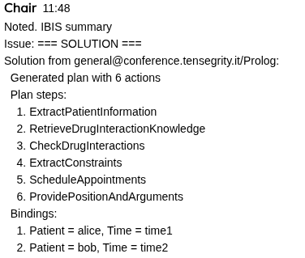
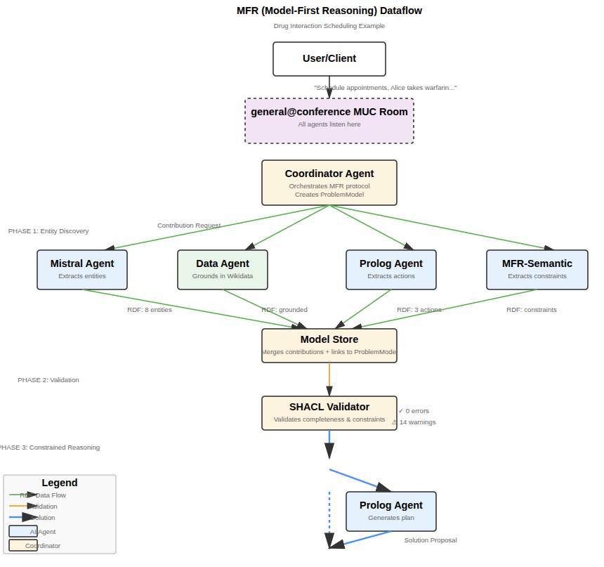

# TIA
TIA Intelligence Agency

An experimental XMPP (Jabber) agent framework that combines chat, Lingue/IBIS structured dialogue, and MCP tool integrations into a modular Node.js codebase.

**Status 2025-12-28:** a community of agents can debate how to solve a problem, run a planning poll to pick an approach, and then invoke MFR or consensus workflows. The system is quite chaotic, but the end-to-end process is working.

* [Live Chat](https://tensegrity.it/chat/) - *or use a standard XMPP client*
* [Documentation](https://danja.github.io/tia/)
* [Lingue Protocol](https://danja.github.io/lingue/)

> Question: Schedule appointments for patients. Alice takes warfarin, Bob takes aspirin. Ensure no drug interactions.

*...a lot of chat later...*



## What TIA Is

TIA is a set of composable building blocks for creating conversational agents that can:
- Participate in XMPP multi-user chats and direct messages.
- Negotiate Lingue language modes and exchange structured payloads.
- Act as MCP clients (discovering tools/resources from servers).
- Act as MCP servers (exposing chat and Lingue tools to external clients).

The design goal is a clean, library-ready architecture that supports both deployable bots and reusable modules.

## Key Concepts

- **XMPP room agents**: long-running bots anchored in MUC rooms.
- **Lingue protocol**: language-mode negotiation + structured payloads (IBIS, Prolog, profiles).
- **MCP bridges**: MCP client and server adapters for tool discovery and exposure.
- **Profiles (RDF)**: agent capabilities live in RDF profiles with shared vocabularies (Mistral variants inherit from `mistral-base`).

## Info Flow

[](docs/debate.svg)  [](docs/dataflow.svg)

## Testbed Server

Use the shared Prosody testbed at `tensegrity.it` to connect with any standard XMPP client. You will first have to register - is just simpe username & password.

Connection details:
- XMPP service: `xmpp://tensegrity.it:5222`
- Domain: `tensegrity.it`
- MUC service: `conference.tensegrity.it`
- TLS: self-signed (set `NODE_TLS_REJECT_UNAUTHORIZED=0` for CLI tools; in GUI clients accept the certificate)

Rooms to join:
- General: `general@conference.tensegrity.it`
- Log room: `log@conference.tensegrity.it`

If your client supports it, set a distinct resource or nickname to avoid collisions.

## Start Here (Docs)

- [Agent Startup Guide](AGENT_STARTUP_GUIDE.md) - **Start here!** Unified script for starting agents
- [Agent roster](docs/agent-roster.md)
- [Agent capabilities & commands](docs/agents.md)
- [Golem Integration](docs/golem-integration.md) - Adaptive role-playing agent for MFR sessions
- [Data Agent guide](docs/data-agent.md) - SPARQL knowledge queries (Wikidata, DBpedia, custom endpoints)
- [Auto-connect & credentials](docs/auto-registration.md) - Automatic credential loading and connection
- [Lingue integration](docs/lingue-integration.md)
- [MCP client guide](docs/mcp-client.md)
- [MCP server guide](docs/mcp-server.md)
- [MFR Room Setup](MFR_ROOM_SETUP.md) - Model-First Reasoning multi-room configuration (**requires Prosody setup**)
- [MFR agent contracts](docs/mfr-agent-contracts.md) - Expected MFR behaviors per agent
- [API reference](docs/api-reference.md)
- [Testing & env](docs/testing.md)
- [Server deployment](docs/server.md)
- [Debate/Chair/Recorder notes](docs/debating-society.md)
- [Lingue ontology & protocol specs](https://danja.github.io/lingue/)

## Architecture At A Glance

- `src/agents` — AgentRunner, providers, and profile system.
- `src/lib` — XMPP helpers, Lingue utilities, logging, RDF tools.
- `src/mcp` — MCP client/server bridges and test servers.
- `config/agents/*.ttl` — RDF profiles describing each agent.
- `config/agents/secrets.json` — local XMPP passwords keyed by profile (ignored in git).
- `docs/` — integration guides and operational docs.

## Implemented Agents

- **Coordinator** — MFR (Model-First Reasoning) orchestrator for multi-agent problem solving.
- **Mistral** — AI chat agent backed by Mistral API with Lingue/IBIS summaries (see `mistral-analyst`, `mistral-creative` profiles).
- **GroqBot** — AI chat agent backed by Groq API (llama-3.3-70b-versatile) with same capabilities as Mistral.
- **Golem** — Malleable AI agent with runtime system prompt changes. Can be assigned logic-focused roles during planning. [Guide](docs/golem-integration.md)
- **Semem** — MCP-backed knowledge agent for `tell/ask/augment` flows.
- **MFR Semantic** — Constraint-focused agent for MFR model construction.
- **Data** — SPARQL knowledge query agent for Wikidata, DBpedia, and custom endpoints. [Guide](docs/data-agent.md)
- **Demo** — Minimal chat bot for quick XMPP smoke checks.
- **Chair** — Debate facilitator/Moderator agent.
- **Recorder** — Meeting logger/recorder agent that listens broadly.
- **Prolog** — Logic agent using tau-prolog for queries.
- **Executor** — Plan execution agent that converts high-level plans into Prolog programs.
- **MCP Loopback** — MCP client/server echo agent for integration tests.

## Quick Start: Running Agents

The `start-all.sh` script provides a unified way to start agents or specific subsets. By default it starts the MFR suite.

```bash
# Start the default MFR suite (same as `./start-all.sh mfr`)
./start-all.sh

# Start MFR (Model-First Reasoning) system
./start-all.sh mfr

# Start debate system
./start-all.sh debate

# Start basic agents
./start-all.sh basic

# Custom agent selection
AGENTS=mistral,data,prolog ./start-all.sh

# Get help
./start-all.sh help
```

**Prerequisites:**
1. Configure `.env` file with API keys (see `.env.example`)
2. Create `config/agents/secrets.json` with XMPP passwords
3. For MFR system: Configure Prosody MUC rooms (see [MFR Room Setup](MFR_ROOM_SETUP.md))
4. Ensure a log room exists (set `LOG_ROOM_JID` explicitly for all agents and create it on the server)

**Agent Presets:**
- `mfr` - MFR system (full suite): coordinator, mistral, analyst, creative, chair, recorder, mfr-semantic, data, prolog, demo
- `debate` - Debate system: chair, recorder, mistral, analyst, creative
- `basic` - Basic agents: mistral, data, prolog, demo

The script automatically:
- Loads `.env` file
- Checks for required API keys
- Skips agents with missing credentials
- Provides restart on crash
- Handles graceful shutdown (SIGTERM/SIGINT)

## Interacting with Agents

### Using the REPL Client

Once agents are running, you can interact with them directly from a chatroom using the REPL client:

```bash
# Connect to the chatroom
NODE_TLS_REJECT_UNAUTHORIZED=0 node src/client/repl.js <username> <password>

# Example:
NODE_TLS_REJECT_UNAUTHORIZED=0 node src/client/repl.js admin admin123
```

### MFR (Model-First Reasoning) Commands

Once connected to the chatroom, you can pose problems to the MFR system:

```
# Start a new MFR session
mfr-start Schedule appointments for patients. Alice takes warfarin, Bob takes aspirin. Ensure no drug interactions.

# Start a debate-driven MFR session (tool selection via Chair)
debate Optimize delivery routes for 3 trucks serving 10 locations.

# Shorthand for debate-driven sessions
Q: Optimize delivery routes for 3 trucks serving 10 locations.

# Check session status
mfr-status <sessionId>

# List active sessions
mfr-list

# Get help
help
```

Debate mode is enabled by default in `config/agents/coordinator.ttl`. `Q:` triggers a planning poll to decide between logic/consensus/Golem logic routes.

**Short command versions:**
- `start` instead of `mfr-start`
- `status` instead of `mfr-status`
- `list` instead of `mfr-list`

**Other MFR commands:**
- `mfr-contribute <sessionId> <rdf>` - Submit a contribution manually
- `mfr-validate <sessionId>` - Validate a model
- `mfr-solve <sessionId>` - Request solutions
 - `debate <problem description>` - Start debate-driven MFR session

### Programmatic MFR Sessions

You can also run MFR sessions programmatically:

```bash
node src/examples/run-mfr-session.js "Your problem description here"
```

This will automatically connect, start a session, wait for the solution, and display the results.

## Library Usage

```javascript
import { AgentRunner, LingueNegotiator, LINGUE, Handlers, InMemoryHistoryStore } from "tia-agents";

const negotiator = new LingueNegotiator({
  profile,
  handlers: {
    [LINGUE.LANGUAGE_MODES.HUMAN_CHAT]: new Handlers.HumanChatHandler()
  }
});

const runner = new AgentRunner({
  profile,
  provider,
  negotiator,
  historyStore: new InMemoryHistoryStore({ maxEntries: 40 })
});
await runner.start();
```

See [examples/minimal-agent.js](examples/minimal-agent.js) for a runnable local example.

## NPM Package Usage

TIA is published as `tia-agents` on npm and supports two approaches to creating bots:

### Quick Start

```bash
npm install tia-agents
```

For a minimal, npm-packaged Mistral bot starter, see `mistral-minimal/README.md`.
If you're using the Mistral provider, install the peer dependency and ensure the API key env var referenced in your profile is set (default: `MISTRAL_API_KEY`).
If you want auto-registration, omit `xmpp:passwordKey` from the profile and set `autoRegister: true` when creating the agent.

### Approach 1: Config-Driven (Profile Files)

Create profile files and use the factory function:

```javascript
import { createAgent, DemoProvider } from "tia-agents";

// Load from config/agents/mybot.ttl
const runner = await createAgent("mybot", new DemoProvider());
await runner.start();
```

Profile file (`config/agents/mybot.ttl`):
```turtle
@prefix agent: <https://tensegrity.it/vocab/agent#> .
@prefix xmpp: <https://tensegrity.it/vocab/xmpp#> .

<#mybot> a agent:ConversationalAgent ;
  agent:xmppAccount [
    xmpp:service "xmpp://localhost:5222" ;
    xmpp:domain "xmpp" ;
    xmpp:username "mybot" ;
    xmpp:passwordKey "mybot"
  ] ;
  agent:roomJid "general@conference.xmpp" .
```

### Approach 2: Programmatic (No Config Files)

Configure everything in code:

```javascript
import { createSimpleAgent, DemoProvider } from "tia-agents";

const runner = createSimpleAgent({
  xmppConfig: {
    service: "xmpp://localhost:5222",
    domain: "xmpp",
    username: "mybot",
    password: "secret"
  },
  roomJid: "general@conference.xmpp",
  nickname: "MyBot",
  provider: new DemoProvider()
});

await runner.start();
```

### Creating Custom Providers

Extend `BaseProvider` to implement your own logic:

```javascript
import { BaseProvider } from "tia-agents";

class MyProvider extends BaseProvider {
  async handle({ command, content, metadata }) {
    if (command !== "chat") return null;
    return `You said: ${content}`;
  }
}

const runner = createSimpleAgent({
  // ... config
  provider: new MyProvider()
});
```

### AI-Powered Bots

Install peer dependency:
```bash
npm install @mistralai/mistralai
```

Use MistralProvider:
```javascript
import { createAgent, InMemoryHistoryStore } from "tia-agents";
import { MistralProvider } from "tia-agents/providers/mistral";

const provider = new MistralProvider({
  apiKey: process.env.MISTRAL_API_KEY,
  historyStore: new InMemoryHistoryStore({ maxEntries: 40 })
});

const runner = await createAgent("aibot", provider);
await runner.start();
```

### Templates & Examples

Copy templates to get started:
```bash
cp -r node_modules/tia-agents/templates/* ./
```

See templates for:
- Profile file examples (`.ttl`)
- Provider templates (simple & LLM patterns)
- Runnable example scripts

### Documentation

- 📚 [Quick Start Guide](docs/quick-start.md) - Detailed getting started guide
- 🔧 [Provider Guide](docs/provider-guide.md) - Creating custom providers
- 📖 [API Reference](docs/api-reference.md) - Complete API documentation
- 📁 [Templates](templates/) - Example configurations and code
- 🌐 GitHub Pages site (generated from `docs/` via `scripts/build-docs.mjs` with `DOCS_DIR` and `DOCS_OUT_DIR`)

## Custom Agent API

For a fuller walkthrough and profile-driven setup, see:
- [Agent developer prompt](docs/agent-dev-prompt.md)
- [Minimal agent example](examples/minimal-agent.js)

## Installation & Running

Quick start - see [Agent Startup Guide](AGENT_STARTUP_GUIDE.md) for complete instructions.

Additional documentation:
- [Agent Startup Guide](AGENT_STARTUP_GUIDE.md) - **Main guide for starting agents**
- [Testing](docs/testing.md)
- [Server](docs/server.md)
- [MCP Server](docs/mcp-server.md)
- [MFR Room Setup](MFR_ROOM_SETUP.md) - **Requires Prosody MUC configuration** for persistent rooms
